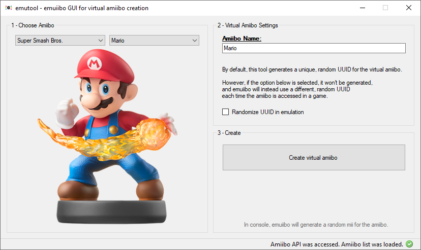

# emuiibo

> Virtual amiibo (amiibo emulation) system for Nintendo Switch, no longer requiring dumps :)

# Table of contents

1. [Usage](#usage)
2. [Amiibo emulation](#amiibo-emulation)
3. [Important notes](#important-notes)
4. [For developers](#for-developers)
5. [Credits](#credits)

## Usage

Download the latest release and place it on your CFW's `titles` folder (so it would be like `<cfw>/titles/0100000000000352`).

According to tests, should work on any CFW which allows NSP sysmodules (Atmosphere, ReiNX).

You also have to set the boot2 flag in the CFW's `/titles` directory: `<cfw>/titles/0100000000000352/flags/boot2.flag`.

### Combos

All the input combos are performed with R-Stick pressing and pressing the D-pad in an specific direction (at the same time). Combos must (should) be done before or after the game starts looking for amiibos.

- **Activate amiibo emulation**: Press R-Stick (like it was a button) and also pressing the D-pad up. Toggles/untoggles emulation.

- **Activate amiibo emulation once**: Same as above, but pressing the D-pad right. Toggles emulation once, after emulating an amiibo then it will untoggle automatically.

- **Deactivate amiibo emulation**: Same as above, but pressing the D-pad down. Untoggles amiibo emulation, and should be used as a way to fully ensure it is untoggled, in case you don't know whether it's toggled or not.

- **Move to next amiibo**: Same as above, but pressing the D-pad left. Moves to the next amiibo in the amiibo directory, if last one starts again with the first one. Only has effect if amiibo emulation is toggled.

### SD layout

- Emuiibo's directory is `sd:/emuiibo`.

- Amiibos go inside `sd:/emuiibo/amiibo`. For instance, an amiibo named `MyMario` would be `sd:/emuiibo/amiibo/MyMario/<json files>`.

- Every time the console is booted, emuiibo saves all the miis inside the console to the SD card. Format is `sd:/emuiibo/miis/<index> - <name>/mii-charinfo.bin`.

## Amiibo emulation

Emuiibo no longer requires dumps to emulate amiibos. Instead, you can use `emutool` PC tool in order to generate virtual amiibos.

### How do virtual amiibos work?

Virtual amiibos consist on a folder containing several JSON files.

A virtual amiibo, in order to be recognised as valid, must contain valid `tag.json`, `register.json`, `common.json` and `model.json` files. This file names were chosen according to the way the console processes amiibos, which are splitted into 4 processed data blocks (TagInfo, ModelInfo, CommonInfo and RegisterInfo).

The only relevant part of an amiibo, which identifies the type of amiibo, is the amiibo ID. Every other parameter can be emulated or isn't that relevant. The NFC UUID, present on amiibo NFC dumps, is randomly generated with virtual amiibos, since it isn't something important whatsoever.

### Miis

Miis can be an issue when attempting to make emuiibo user-friendly. Since mii format is a 88-byte data block named "CharInfo" and we have no way to see char-infos rendered but in the console itself, there is no simple way to change the mii.

## Important notes

If (**with emuiibo activated!**) the title responds with an error similar to "No controller which supports NFC was found" probably means that emuiibo failed to supply the amiibo (wrong amiibo, internal error...). That error is displayed due to limitations with real NFC error codes.

## For developers

emuiibo also hosts a custom service, `nfp:emu`, which can be used to control amiibo emulation by IPC commands.

You have an implementation for C/C++ and libnx in [here](nfpemu-libnx).

## Credits

- Everyone who contributed to the original **nfp-mitm** project (forks): *Subv, ogniK, averne, spx01, SciresM*

- **libstratosphere** project and libraries

- **AmiiboAPI** (JSON API), which is used by `emutool` to get a proper, full amiibo list, in order to generate virtual amiibos without the need of raw dumps.